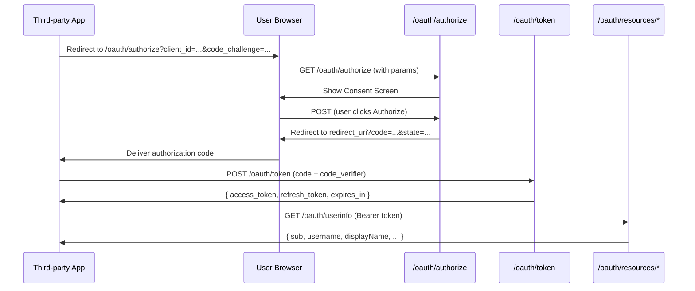

# Design Document: OasisBio OAuth Provider

## Overview

实现标准 OAuth 2.0 Authorization Code Flow + PKCE，让 OasisBio 成为 OAuth 供应商。包含：开发者门户（应用注册）、授权端点、Token 端点、资源 API、以及 "Continue with Oasis" 集成文档。

## Architecture



## Components and Interfaces

### Database Tables (new)

#### `oauth_apps`
```sql
id              uuid PRIMARY KEY DEFAULT gen_random_uuid()
owner_user_id   text NOT NULL REFERENCES users(id) ON DELETE CASCADE
name            text NOT NULL
description     text
homepage_url    text NOT NULL
logo_url        text
redirect_uris   text[] NOT NULL  -- validated HTTPS or localhost
client_id       text UNIQUE NOT NULL  -- UUID, public
client_secret_hash text NOT NULL     -- bcrypt hash, never stored plaintext
is_active       boolean DEFAULT true
created_at      timestamptz DEFAULT now()
updated_at      timestamptz DEFAULT now()
```

#### `oauth_authorization_codes`
```sql
id              uuid PRIMARY KEY DEFAULT gen_random_uuid()
code            text UNIQUE NOT NULL  -- 32-byte random hex
client_id       text NOT NULL
user_id         text NOT NULL
redirect_uri    text NOT NULL
scope           text NOT NULL         -- space-separated
code_challenge  text NOT NULL         -- S256 PKCE challenge
used_at         timestamptz           -- null = unused
expires_at      timestamptz NOT NULL  -- now() + 10 minutes
created_at      timestamptz DEFAULT now()
```

#### `oauth_tokens`
```sql
id              uuid PRIMARY KEY DEFAULT gen_random_uuid()
client_id       text NOT NULL
user_id         text NOT NULL
scope           text NOT NULL
access_token    text UNIQUE NOT NULL   -- JWT (not stored, derived)
refresh_token   text UNIQUE NOT NULL   -- 32-byte random hex
refresh_token_hash text NOT NULL       -- stored hash
revoked_at      timestamptz
expires_at      timestamptz NOT NULL   -- refresh token expiry (30 days)
created_at      timestamptz DEFAULT now()
```

Note: `access_token` is a signed JWT — we store only the `jti` (JWT ID) for revocation lookup. The actual JWT is never stored.

### API Routes

#### Developer Portal

| Route | Method | Description |
|-------|--------|-------------|
| `/developer/apps` | GET | List developer's apps (page) |
| `/developer/apps/new` | GET | Create app form (page) |
| `/developer/docs` | GET | Integration documentation (page) |
| `/api/developer/apps` | GET | List apps (API) |
| `/api/developer/apps` | POST | Create app |
| `/api/developer/apps/[id]` | GET | Get app |
| `/api/developer/apps/[id]` | PUT | Update app |
| `/api/developer/apps/[id]` | DELETE | Delete app + revoke tokens |
| `/api/developer/apps/[id]/secret` | POST | Rotate client_secret |

#### OAuth Endpoints

| Route | Method | Description |
|-------|--------|-------------|
| `/oauth/authorize` | GET | Show consent screen |
| `/oauth/authorize` | POST | Process authorization decision |
| `/oauth/token` | POST | Exchange code / refresh token |
| `/oauth/revoke` | POST | Revoke token |
| `/oauth/.well-known/openid-configuration` | GET | OIDC discovery |

#### Resource API

| Route | Method | Scope Required |
|-------|--------|---------------|
| `/oauth/userinfo` | GET | `profile` |
| `/oauth/resources/oasisbios` | GET | `oasisbios:read` |
| `/oauth/resources/oasisbios/[id]` | GET | `oasisbios:full` |
| `/oauth/resources/oasisbios/[id]/dcos` | GET | `dcos:read` |

### Core Library: `src/lib/oauth/`

```
src/lib/oauth/
├── crypto.ts       # PKCE verification, token signing, secret hashing
├── validate.ts     # Parameter validation, scope parsing, URI validation
├── tokens.ts       # JWT creation/verification, refresh token management
└── scopes.ts       # Scope definitions and permission checks
```

#### `src/lib/oauth/crypto.ts`

```typescript
// PKCE: verify code_verifier against stored code_challenge
verifyPKCE(codeVerifier: string, codeChallenge: string): boolean

// JWT: sign access token
signAccessToken(payload: { sub, clientId, scope, jti }): string

// JWT: verify and decode access token
verifyAccessToken(token: string): AccessTokenPayload | null

// Secret: hash client_secret for storage
hashClientSecret(secret: string): Promise<string>

// Secret: verify client_secret against stored hash
verifyClientSecret(secret: string, hash: string): Promise<boolean>

// Generate cryptographically random hex string
generateSecret(bytes?: number): string
```

#### `src/lib/oauth/scopes.ts`

```typescript
export const SCOPES = {
  profile: 'Access your basic profile (username, display name, avatar)',
  email: 'Access your email address',
  'oasisbios:read': 'View your character list',
  'oasisbios:full': 'View your characters\' full details (abilities, worlds, eras)',
  'dcos:read': 'Read your DCOS documents',
} as const;

export type ScopeName = keyof typeof SCOPES;

// Parse space-separated scope string into array
parseScopes(scopeString: string): ScopeName[]

// Check if token has required scope
hasScope(tokenScope: string, required: ScopeName): boolean
```

### Pages

#### `/oauth/authorize` — Consent Screen

```
┌─────────────────────────────────────┐
│  [App Logo]  App Name               │
│  wants to access your OasisBio      │
│                                     │
│  This app will be able to:          │
│  ✓ View your profile                │
│  ✓ View your character list         │
│  ✓ Read your DCOS documents         │
│                                     │
│  Authorizing as: @username          │
│                                     │
│  [Deny]          [Authorize]        │
└─────────────────────────────────────┘
```

#### `/developer/apps` — Developer Portal

Lists registered apps with client_id, creation date, and management actions.

#### `/developer/docs` — Integration Docs

Step-by-step guide with code examples for implementing "Continue with Oasis".

## Data Models

### Access Token JWT Payload

```typescript
interface AccessTokenPayload {
  sub: string;        // user_id
  client_id: string;
  scope: string;      // space-separated
  jti: string;        // JWT ID (for revocation)
  iat: number;        // issued at
  exp: number;        // expires at (iat + 3600)
  iss: string;        // 'https://oasisbio.com'
}
```

### Token Response

```typescript
interface TokenResponse {
  access_token: string;
  token_type: 'Bearer';
  expires_in: 3600;
  refresh_token: string;
  scope: string;
}
```

### UserInfo Response

```typescript
interface UserInfoResponse {
  sub: string;           // user_id (always present)
  // profile scope:
  username?: string;
  display_name?: string;
  avatar_url?: string;
  // email scope:
  email?: string;
}
```

## Correctness Properties

*A property is a characteristic or behavior that should hold true across all valid executions of a system—essentially, a formal statement about what the system should do.*

Property 1: Client credential generation uniqueness
*For any* two app creation requests, the generated `client_id` values must be distinct, and each `client_secret` must be a 64-character hex string.
**Validates: Requirements 1.2**

Property 2: Redirect URI validation
*For any* URI string, `validateRedirectUri` should accept only valid HTTPS URLs and `http://localhost` variants, and reject all others (HTTP non-localhost, invalid format, missing scheme).
**Validates: Requirements 1.4**

Property 3: PKCE verification correctness
*For any* `code_verifier` string, `verifyPKCE(verifier, sha256(base64url(verifier)))` must return true, and `verifyPKCE(verifier, differentChallenge)` must return false.
**Validates: Requirements 5.1, 5.3**

Property 4: Access token contains correct claims
*For any* issued access token, decoding the JWT should reveal `sub` matching the user_id, `client_id` matching the app, `scope` matching the authorized scope, and `exp = iat + 3600`.
**Validates: Requirements 5.4**

Property 5: Scope enforcement — insufficient scope returns 403
*For any* resource endpoint and any access token whose scope does not include the required scope for that endpoint, the response must be HTTP 403 with `error=insufficient_scope`.
**Validates: Requirements 4.6**

Property 6: Refresh token rotation
*For any* valid refresh token, using it once should succeed and return a new refresh token. Using the same refresh token a second time must fail with `error=invalid_grant`.
**Validates: Requirements 3.4, 5.7**

Property 7: Authorization code is single-use
*For any* valid authorization code, exchanging it once should succeed. Exchanging the same code a second time must fail with `error=invalid_grant`.
**Validates: Requirements 2.4**

## Error Handling

All OAuth errors follow RFC 6749 format:

```json
{ "error": "invalid_request", "error_description": "Human readable description" }
```

| Error Code | Scenario |
|-----------|---------|
| `invalid_request` | Missing or malformed parameters |
| `invalid_client` | Unknown client_id or wrong client_secret |
| `invalid_grant` | Expired/used authorization code or refresh token |
| `access_denied` | User denied authorization |
| `unsupported_grant_type` | Grant type not supported |
| `invalid_scope` | Requested scope not recognized |
| `insufficient_scope` | Token lacks required scope for resource |
| `invalid_token` | Expired or revoked access token |

## Testing Strategy

### Tools
- Jest + fast-check (already installed)

### Property Tests (fast-check, ≥100 iterations each)
- Property 1: credential uniqueness
- Property 2: URI validation
- Property 3: PKCE verification
- Property 4: JWT claims
- Property 5: scope enforcement
- Property 6: refresh token rotation
- Property 7: authorization code single-use

### Unit Tests
- Token exchange happy path
- Consent screen rendering
- App CRUD operations
- Error response format compliance

Tag format: `// Feature: oauth-provider, Property N: <description>`
