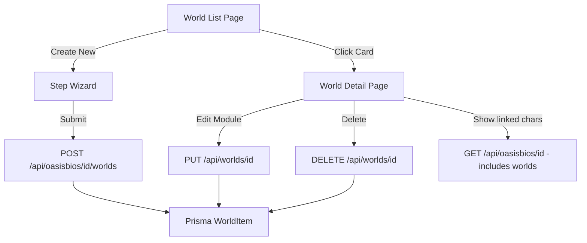

# Design Document: World Builder

## Overview

完全重写世界观填写功能。核心思路：用分步向导降低创建门槛，用语义化模块提升填写质量，用卡片网格提升浏览体验，用内联编辑提升修改效率。整体风格延续 OasisBio 的黑白极简设计语言。

## Architecture



**页面结构：**
```
/dashboard/oasisbios/[id]/worlds          ← 世界列表（卡片网格）
/dashboard/oasisbios/[id]/worlds/new      ← 分步创建向导
/dashboard/oasisbios/[id]/worlds/[wid]    ← 世界详情编辑器
```

## Components and Interfaces

### 1. WorldListPage — 世界列表

**布局：** 卡片网格（3列 desktop / 2列 tablet / 1列 mobile）

**组件树：**
```
WorldListPage
├── PageHeader（标题 + "Create New World" 按钮）
├── EmptyState（无世界时显示）
└── WorldGrid
    ├── CreateWorldCard（始终显示在第一位）
    └── WorldCard × N
        ├── GenreTag + ToneTag
        ├── WorldName
        ├── SummaryExcerpt（max 80 chars）
        ├── CompletionBar（进度条 + 百分比）
        └── UpdatedAt
```

### 2. StepWizard — 分步创建向导

**6 步结构：**

| Step | Module | 必填字段 | 可选字段 |
|------|--------|---------|---------|
| 1 | Core Identity | name, summary | tagline, genre, tone |
| 2 | Time Structure | — | eraName, timePeriod, timeline, majorEvents |
| 3 | World Rules | — | physicsRules, technologyLevel, powerSystem, limitations |
| 4 | Civilization | — | governance, economy, factions, socialStructure, culture |
| 5 | Environment | — | geography, cities, landmarks, environmentalFeatures |
| 6 | Narrative Context | — | conflict, themes, storyHooks, characterRoles |

**组件树：**
```
StepWizard
├── WizardHeader
│   ├── StepIndicator（"Step 2 of 6"）
│   ├── StepTitle
│   └── ProgressBar（filled segments）
├── StepContent（动态渲染当前步骤）
│   ├── ModuleDescription（一句话说明）
│   └── FieldGroup × N
│       ├── FieldLabel + ExampleHint
│       └── Input / Textarea / SelectTags
└── WizardFooter
    ├── BackButton（step > 1）
    ├── SkipButton（非必填步骤）
    └── NextButton / CreateButton（最后一步）
```

**状态管理：**
```typescript
interface WizardState {
  currentStep: number; // 1-6
  data: WorldFormData;
  isSubmitting: boolean;
}

interface WorldFormData {
  // Step 1 - Core Identity
  name: string;
  tagline: string;
  genre: string;
  tone: string;
  summary: string;
  // Step 2 - Time Structure
  timeSetting: string;      // era_name
  timeline: string;         // key events
  // Step 3 - World Rules
  physicsRules: string;
  rules: string;            // power system + limitations
  // Step 4 - Civilization
  socialStructure: string;
  factions: string;
  // Step 5 - Environment
  geography: string;
  // Step 6 - Narrative Context
  majorConflict: string;
  // visibility
  visibility: 'private' | 'public';
}
```

**字段映射到 Prisma WorldItem：**
```
name           → name
summary        → summary
tagline        → (存入 summary 前缀，或扩展 schema)
genre          → aestheticKeywords (暂用，后续扩展)
tone           → aestheticKeywords (暂用，后续扩展)
timeSetting    → timeSetting
timeline       → timeline
physicsRules   → physicsRules
rules          → rules
socialStructure → socialStructure
factions       → factions
geography      → geography
majorConflict  → majorConflict
```

> 注：genre/tone 当前 schema 无独立字段，暂存入 `aestheticKeywords`（JSON 格式），后续 schema 迁移时独立。

### 3. WorldDetailPage — 世界详情编辑器

**布局：** 单页，顶部摘要 + 6 个可折叠模块

**组件树：**
```
WorldDetailPage
├── DetailHeader
│   ├── BackLink（← Back to Worlds）
│   ├── WorldName + GenreTag + ToneTag
│   ├── CompletionScore（大字显示，如 "72%"）
│   └── DeleteButton
├── ModuleSection × 6
│   ├── ModuleHeader（标题 + 完成度 + Edit按钮）
│   ├── ViewMode（只读展示）
│   └── EditMode（内联表单）
└── CharacterSection
    ├── SectionTitle（"Characters in this World"）
    └── CharacterChip × N（头像 + 名字 + 链接）
```

**内联编辑状态：**
```typescript
interface EditState {
  activeModule: string | null; // 当前编辑的模块名
  pendingChanges: Partial<WorldFormData>;
  isSaving: boolean;
  saveError: string | null;
}
```

### 4. 工具函数

```typescript
// 计算世界完整度
function calculateCompletionScore(world: WorldItem): number

// 获取模块的已填字段数
function getModuleCompletion(world: WorldItem, module: WorldModule): { filled: number; total: number }

// 截断摘要
function truncateSummary(summary: string, maxLength: number): string
```

## Data Models

现有 `WorldItem` Prisma 模型已覆盖大部分字段，无需 schema 变更。

字段使用规划：

| Prisma 字段 | 对应模块 | 用途 |
|------------|---------|-----|
| name | Core Identity | 世界名称 |
| summary | Core Identity | 世界摘要 |
| timeSetting | Time Structure | 时代名称/时间设定 |
| timeline | Time Structure | 时间线/重大事件 |
| physicsRules | World Rules | 物理规则 |
| rules | World Rules | 力量体系+限制 |
| socialStructure | Civilization | 社会结构+治理 |
| factions | Civilization | 派系 |
| geography | Environment | 地理+城市+地标 |
| majorConflict | Narrative Context | 冲突+主题+故事钩子 |
| aestheticKeywords | Core Identity | 暂存 genre+tone（JSON） |
| visibility | — | 可见性 |

**完整度计算字段列表（共 10 个）：**
`name, summary, timeSetting, timeline, physicsRules, rules, socialStructure, factions, geography, majorConflict`

## Correctness Properties

*A property is a characteristic or behavior that should hold true across all valid executions of a system—essentially, a formal statement about what the system should do. Properties serve as the bridge between human-readable specifications and machine-verifiable correctness guarantees.*

Property 1: Step wizard renders correct metadata for every step
*For any* step index between 1 and 6, the wizard should render a non-empty step title, a non-empty module description, and at least one example hint.
**Validates: Requirements 1.2, 2.2**

Property 2: Navigation preserves data (round-trip)
*For any* step index and any form data entered at that step, navigating to the next step and then back should result in the same form data being present.
**Validates: Requirements 1.3, 1.4**

Property 3: Completion score formula correctness
*For any* WorldItem with any combination of filled and empty fields, `calculateCompletionScore` should return `Math.round((filledCount / 10) * 100)` where `filledCount` is the number of non-null, non-empty string fields among the 10 tracked fields.
**Validates: Requirements 3.6**

Property 4: World card renders all required display fields
*For any* WorldItem, the rendered WorldCard should contain the world name, summary excerpt (≤ 80 chars), and completion score.
**Validates: Requirements 3.2**

Property 5: Validation — name and summary are required
*For any* form submission where name is empty or summary is empty, the wizard should reject the submission and not call the API.
**Validates: Requirements 1.7**

## Error Handling

| 场景 | 处理方式 |
|------|---------|
| 创建世界 API 失败 | 显示错误 toast，保留向导数据，允许重试 |
| 更新模块 API 失败 | 显示内联错误，保留未保存的编辑内容 |
| 删除世界 API 失败 | 显示错误，取消删除 |
| 网络超时 | 自动重试一次，失败后提示用户 |
| 加载世界列表失败 | 显示错误状态 + 重试按钮 |

## Testing Strategy

### 工具
- 单元/属性测试：Jest + fast-check（已安装）
- 组件测试：@testing-library/react（已安装）

### 属性测试（fast-check，每个属性 ≥ 100 次迭代）

每个属性测试注释格式：`// Feature: world-builder, Property N: <description>`

- Property 3 (`calculateCompletionScore`) — 纯函数，最适合属性测试
- Property 5 (validation) — 生成随机的空/非空 name+summary 组合
- Property 2 (navigation round-trip) — 生成随机步骤数据，验证往返一致性
- Property 1 (step metadata) — 遍历所有 6 个步骤验证元数据完整性
- Property 4 (card rendering) — 生成随机 WorldItem，验证卡片渲染

### 单元测试覆盖
- `calculateCompletionScore`：边界值（全空、全填、部分填）
- `truncateSummary`：超长、恰好 80 字符、空字符串
- `getModuleCompletion`：每个模块的字段计数
- Wizard 步骤导航逻辑
- 表单验证逻辑
